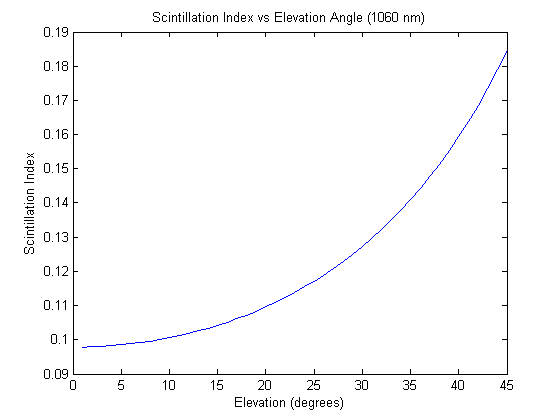
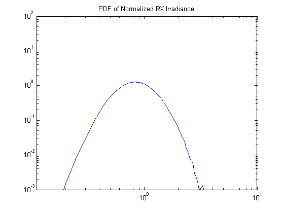

Fso Module
----------

.. include:: replace.txt
.. highlight:: cpp

.. heading hierarchy:
   ------------- Chapter
   ************* Section (#.#)
   ============= Subsection (#.#.#)
   ############# Paragraph (no number)

The Fso module looks to provide a model for free-space optical communication links. It is currently under development as part of the SOCIS 2016 Optical Satellite Systems (OSS) project.

Model Description
*****************

The Fso module provides:

* Propagation loss models for optical signals traveling through the atmosphere and free space

* Antenna models for a laser and optical receiver

* A Physical and a channel class to implement a free-space optical link

The source code for the Fso module is located at ``src/fso``.

Design
======

Propagation Loss Model
######################

The propagation loss is modeled in three separate classes, all deriving from the FsoPropagationLossModel class: FsoMeanIrradianceModel, FsoDownLinkScintillationIndexModel and FsoFreeSpaceLossModel. These classes model the losses incurred due to an optical signal being transmitted at high altitude ( >> 20 km) to a receiver at a lower altitude (i.e. a geosynchronous satellite to a low earth orbit satellite or an optical ground station on Earth). This model would specifically suit the needs of a 'downlink' channel for satellites.

The model provides the irradiance (Watts/meter) at the receiver, which is described by a log-normal distribution [LaserPropagationBook]_. The distribution of the irradiance at the receiver, :math:'p_{I}(I) ,is a function of the scintillation index :math:'\sigma^{2}_{I}' and the mean irradiance :math:'\langle I(\textbf{r}, L) \rangle':

.. math::
   p_{I}(I) = \frac{1}{I\sigma_{I}(\textbf{r}, L)\sqrt(2\pi)}exp\Bigg(-\frac{\bigg[ln\big(\frac{I}{\langle I(\textbf{r}, L) \rangle}\big) + \frac{1}{2}\sigma^{2}_{I}(\textbf{r}, L)\bigg]^{2}}{2\sigma^{2}_{I}(\textbf{r}, L)}\Bigg)

where :math:'\textbf{r}' is the transverse observation point. The mean irradiance and can be expressed as follows:

.. math::
  \langle I(\textbf{r}, L) \rangle = \frac{W^{2}_{0}}{W^{2}_{LT}}exp\bigg(-\frac{2r^{2}}{W^{2}_{LT}}\bigg)

where :math:'W^{2}_{0}' is the beam radius at the transmitter, :math:'W^{2}_{LT}' is the effective spot size of the beam in the presence of atmospheric turbulence, and :math:'r' is the radial distance from the center of the beam. 

The scintillation index can be simplified in the downlink case, due to the beam effectively appearing as an unbounded plane wave once it enters the atmosphere. The scintillation index used for the downlink model is: 

.. math:: 
   \sigma_{I}^{2}(r, L) = 2.25k^{7/6}\sec^{11/6}(\zeta)\int^{H}_{H_{GS}}C^{2}_{n}(h)[h-h_{GS}]^{5/6}\,dh

where :math:'k = 2\pi/\lambda' and :math:'\lambda' is the wavelength of the optical beam, :math:'H' is the altitude of the transmitter, :math:'\zeta' is the elevation angle, :math:'H_{GS}' is the altitude of the ground station, and :math:'C_{n}^{2}(h)' is the index of refraction of the atmosphere as a function of altitude. The index of refraction can be described by a modified version of the Hufnagel-Valley model [SatOpticalFeederLinks2014]_:

.. math::
   C_{n}^{2}(h)  =& Ae^{-H_{GS}/700}e^{-(h-H_{GS})/100}\\ 
                    &+ 5.94\times 10^{-53}\frac{v}{27}^{2}h^{10}e^{-h/1000}\\
		    &+ 2.7\times 10^{-16}e^{-h/1500}
   :label: index-refraction

where :math:'A' is the refractive index structure parameter at ground level and :math:'v' is the root-mean-square wind speed.

The FsoFreeSpaceLossModel provides the free space path loss in dB according to the following equation for electromagnetic waves:

.. math::
   FSPL  =& 20\log_{10}\big(\frac{4\pi d}{\lambda}
   :label: free-space-path-loss

Channel Model
#############

The FsoChannel class acts as a container object, holding pointers to the the FsoPhy receivers and transmitters, the FsoPropagationLossModel classes, and the PropagationDelayModel. It also provides the transmission of packets from a transmitter to receivers.

Phy Model
#########

The FsoPhy class assigns the FsoSignalParameters related to the transmitter (when transmitting), contains an error model to determine the probability of error of a received packet (when receiving), and contains the interface for a NetDevice (not yet implemented).  

Error Model
###########

The error model currently computes the signal irradiance at the receiver based on the log normal distribution presented in the Propagation Loss Model section above. This will be changed in the future to provide the probability of packet error through the calculation of a bit error rate (BER) based on the signal irradiance at the receiver and properties of the optical receiver.  

Signal Parameters
#################

The FsoSignalParameters struct contains the properties of the optical signal and propagation loss parameters. The FsoPhy initializes the values from the LaserAntennaModel (power, beamwidth, etc.) and the FsoPropagationLossModels update the loss parameters (mean irradiance, free space loss, and scintillation index). The signal parameters are then passed on to the error model at the receiving FsoPhy.   

Laser/Optical Receiver Model
############################

The LaserAntennaModel class characterizes a laser by its transmit wavelength, beamwidth, transmitter power, transmitter gain, and it's orientation. The orientation is not currently used and is reserved for future development.

The OpticalRxAntennaModel class characterizes the receiver by its gain, aperture size, and orientation.

Scope and Limitations
=====================

The Fso module currently can provide a model of an atmospheric channel for optical signals. It is designed with the OSS project as the primary application. There is no consideration for interference between signals and it is assumed there is a single transmitter per channel which may service multiple receivers in a concentrated area (i.e. around a ground station). Only the downlink channel is considered, and the FsoDownLinkScintillationIndexModel reflects that, as some simplifications are made which correspond to a downlink channel. Future work may involve creating uplink specific models. 

References
==========

.. [LaserPropagationBook] L.C. Andrews and R.L. Philips, "Laser Satellite Communication Systems" in Laser Beam Propagation through Random Media, 2nd ed. Bellingham, Washington; SPIE, 2005, ch. 12 

.. [SatOpticalFeederLinks2014] S. Dimitrov et al. "Digital Modulation and Coding for Satellite Optical Feeder Links", ASMS/SPSC 2014

Usage
*****

The principle use case of the Fso module is to model free space optical links between satellites and optical ground stations.

 * The Fso module has four base classes: ``FsoChannel``, ``FsoPhy``, ``FsoErrorModel`` (abstract base class), and ``FsoPropagationLossModel`` (abstract base class).

 * Two new classes derived from ``AntennaModel`` are provided: ``LaserAntennaModel`` and ``OpticalRxAntennaModel`` for the transmitter and receiver respectively.

 * The ``FsoSignalParameters`` struct contains all relevant optical signal parameters. 

 * ``FsoChannel`` contains a pointer to a ``FsoPropagationLossModel`` and the loss models are chained together to allow for multiple channel effects (i.e. free space loss, scintillation, etc.). To implement a new loss model you must derive from ``FsoPropagationLossModel``. Each loss model provided by the module acts upon the ``FsoSignalParameters`` struct passed to it. The loss models should not be inter-dependent on each other.

 * The channel model currently assumes only a single transmitter, which may transmit to multiple receivers.  

 * The ``FsoErrorModel`` abstract base class must be derived from to provide an error model to the ``FsoPhy``. The Fso module provides ``FsoDownLinkErrorModel`` as an error model class for the downlink case (satellite to optical ground station unidirectional link) and can be used as reference for the creation of new error models.

Building New Module
===================

The Fso module requires the use of the GNU Scientific Library (GSL). The installation instructions for GSL can be found here: https://www.nsnam.org/wiki/Installation

Helpers
=======

Helpers are still under development.

Attributes
==========

What classes hold attributes, and what are the key ones worth mentioning?

``FsoChannel`` contains attributes for pointers to the ``PropagationDelayModel`` and the ``FsoPropagationLossModel``.

``FsoPhy`` contains an attribute for the bit rate. The default value is 49.3724 Mbits/second.

If a satellite to ground station link is being considered, the ''FsoDownLinkScintillationIndexModel'' loss model contains ``Windspeed`` and ``GroundRefractiveIndex`` attributes which characterize the atmospheric model. The default values for these attributes correspond to the Hufnagel-Valley 5/7 model (clear atmospheric conditions). 

The ``LaserAntennaModel`` and ``OpticalRxAntennaModel`` classes contain attributes for all antenna properties. These should be set by the user. Note that the orientation attribute is currently not used. 

Output
======

What kind of data does the model generate?  What are the key trace
sources?   What kind of logging output can be enabled?

Examples
========

Currently only one example is available in the 'fso-example.cc' source file. It considers a geo-synchronous satellite and an optical ground station downlink channel (satellite transmitter to ground station receiver). No helpers are available at this time, therefore the example illustrates how to setup the various components required for the link.   

Troubleshooting
===============

Not yet completed.

Validation
**********

Each mathematical model has a corresponding Matlab script provided in the fso/src/test/references folder. The FsoPropagaionLossTestSuite provides validation that each propagation loss model is being correctly calculated according to the provided Matlab scripts. The link parameters chosen for these tests are from published work:

"Preliminary Results of Terabit-per-second Long-Range Free-Space Optical Transmission Experiment THRUST" and "Overview of the Laser Communication System for the NICT Optical Ground Station and Laser Communication Experiments on Ground-to-Satellite Links".

An example program provided in "examples/fso-irradiance-curve.cc" stores the normalized irradiance at the receiver for a large number of packets. These values are stored in a data set and saved in a plot file. A Matlab script is provided to compare the data set to a generated probability density function.       
